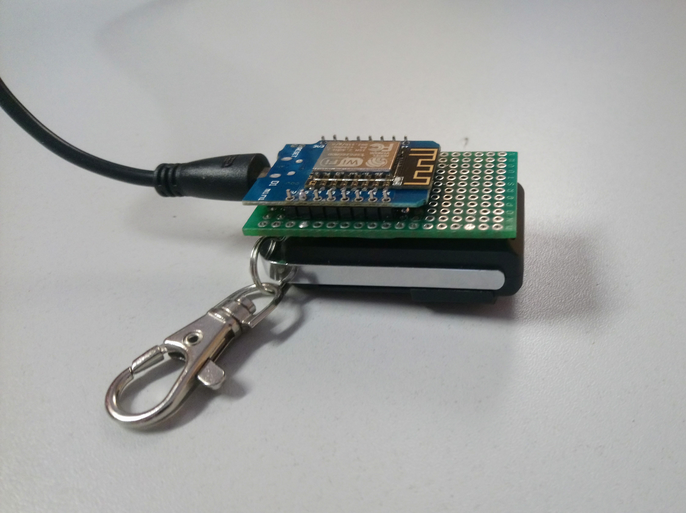
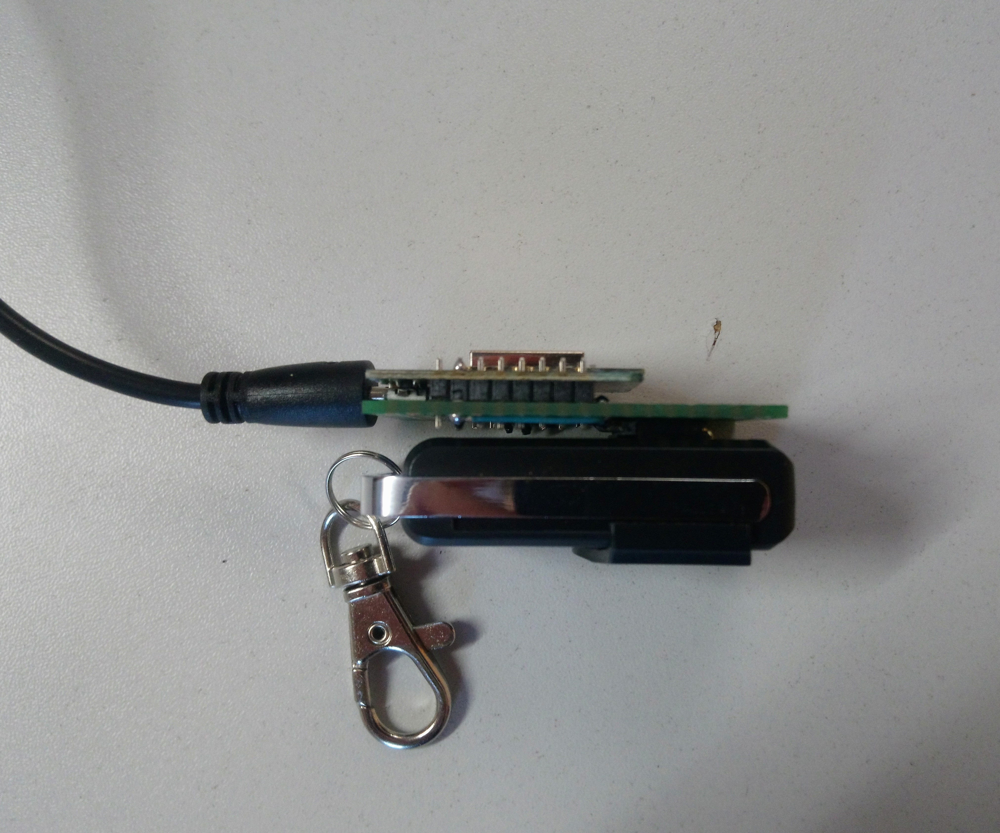
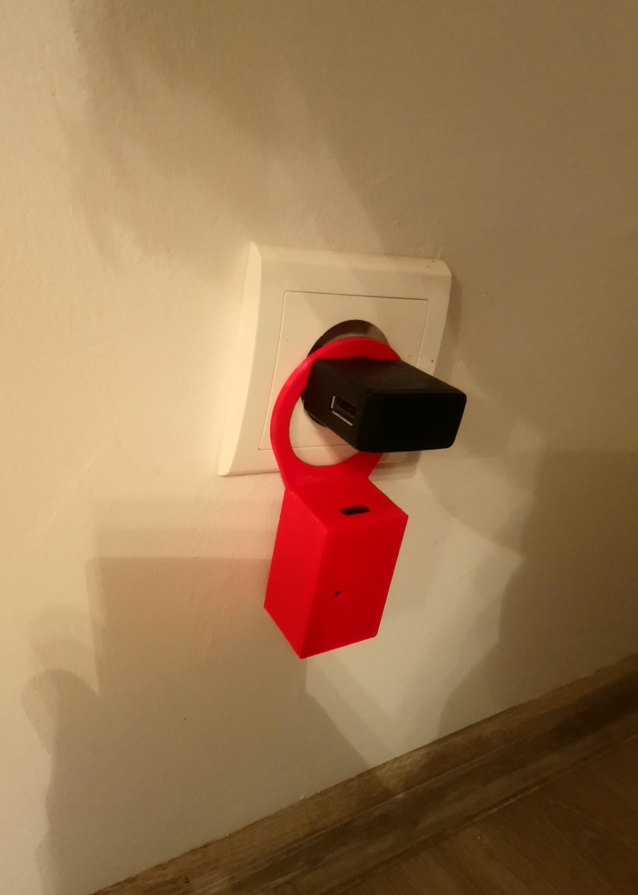

# ESP Roller Hack

Projekt prostego urządzenia, które jest zarządzane przez platformę smarthome Sinric. Za pomocą Sinric istnieje możliwość integracji z google home.

Urządzenie steruje podłączonym do niego dwukanałowym pilotem radiowym do rolet zewnętrznych. Przyciski pilota są zwierane za pomocą tranzystorów. Pilot został zaprogramowany aby  otwierać i zamykać wszystkie rolety w domu.
Dzięki sinric lub google home można stworzyć automatyzację, która będzie zamykać i otwierać rolety np. o zadanej godzinie.

